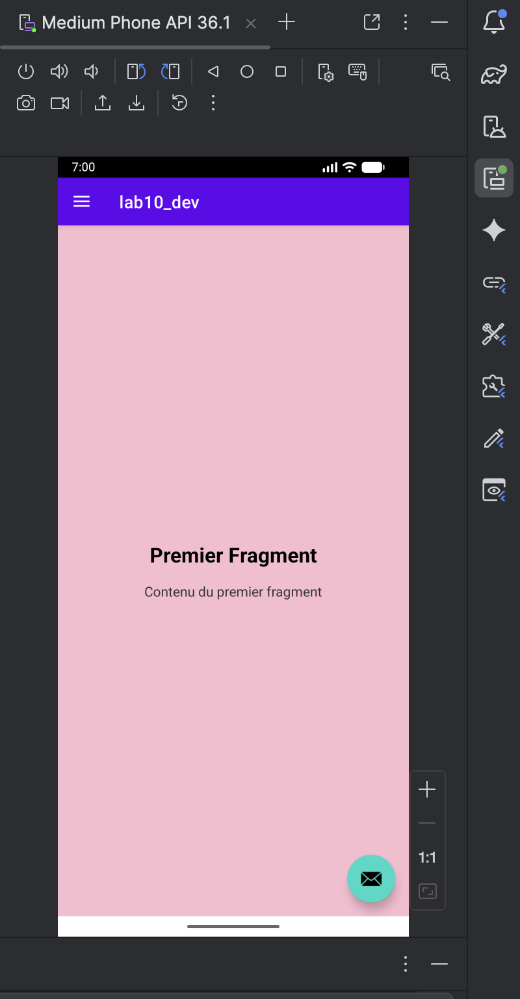
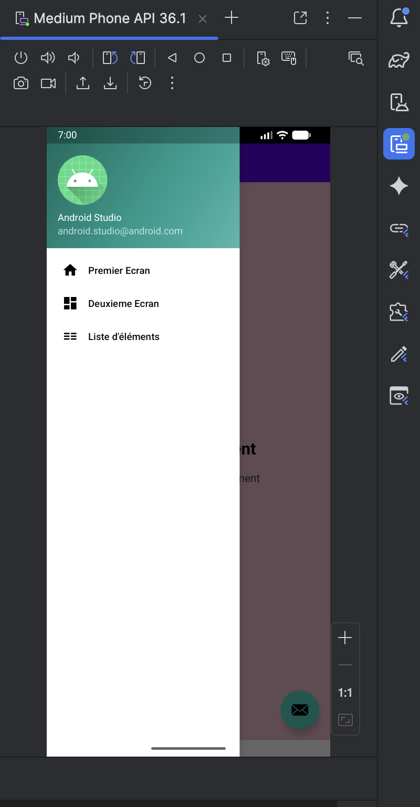
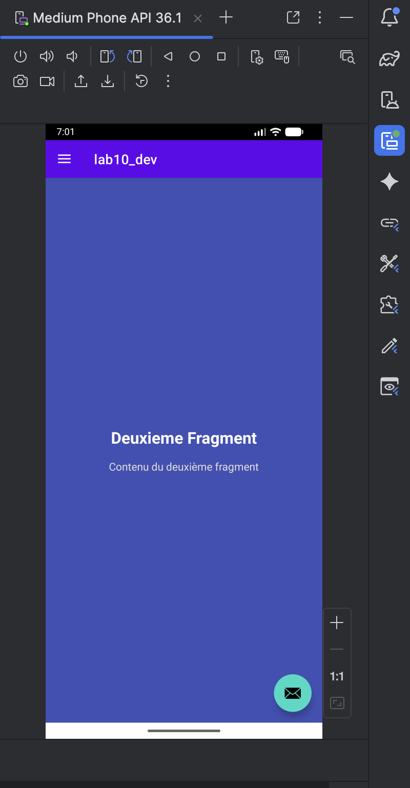
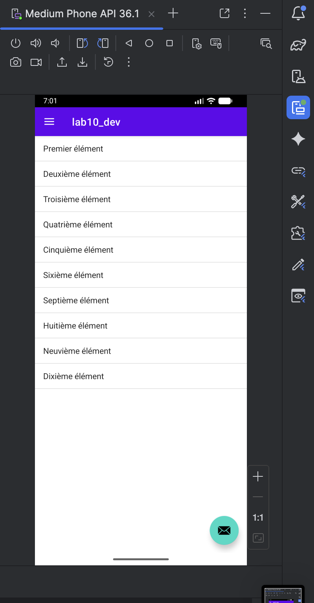
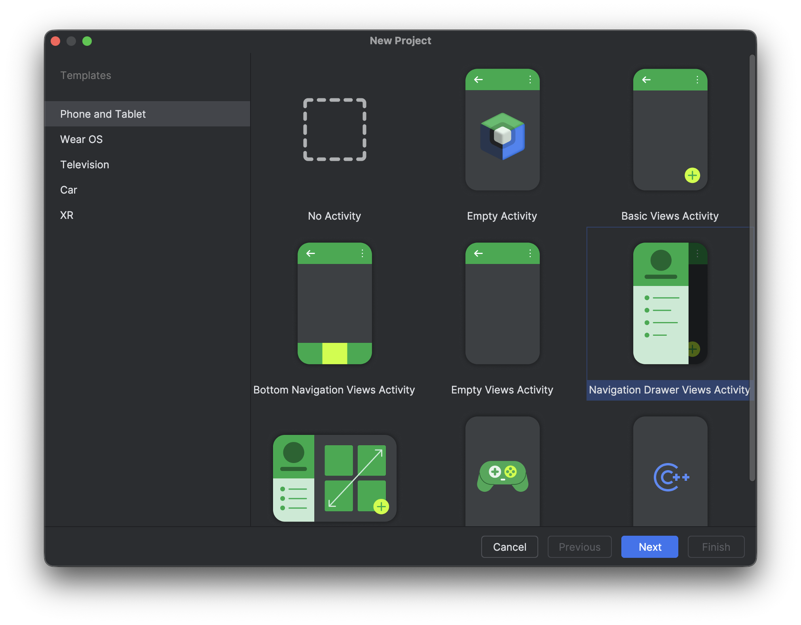
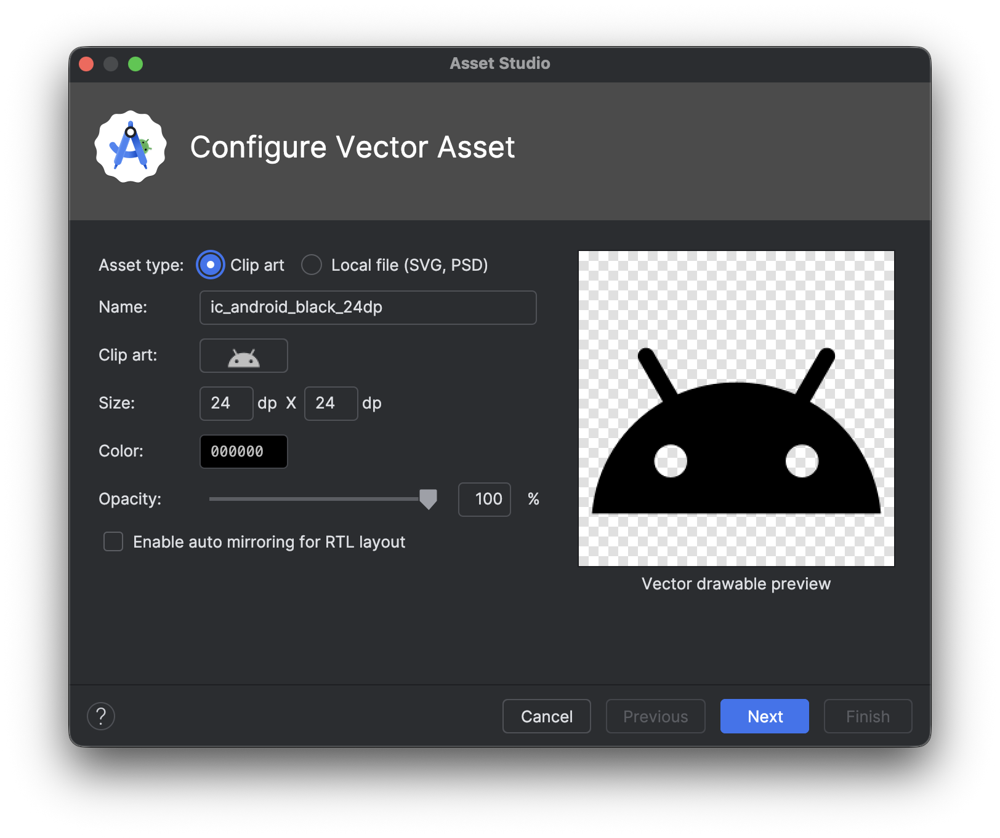
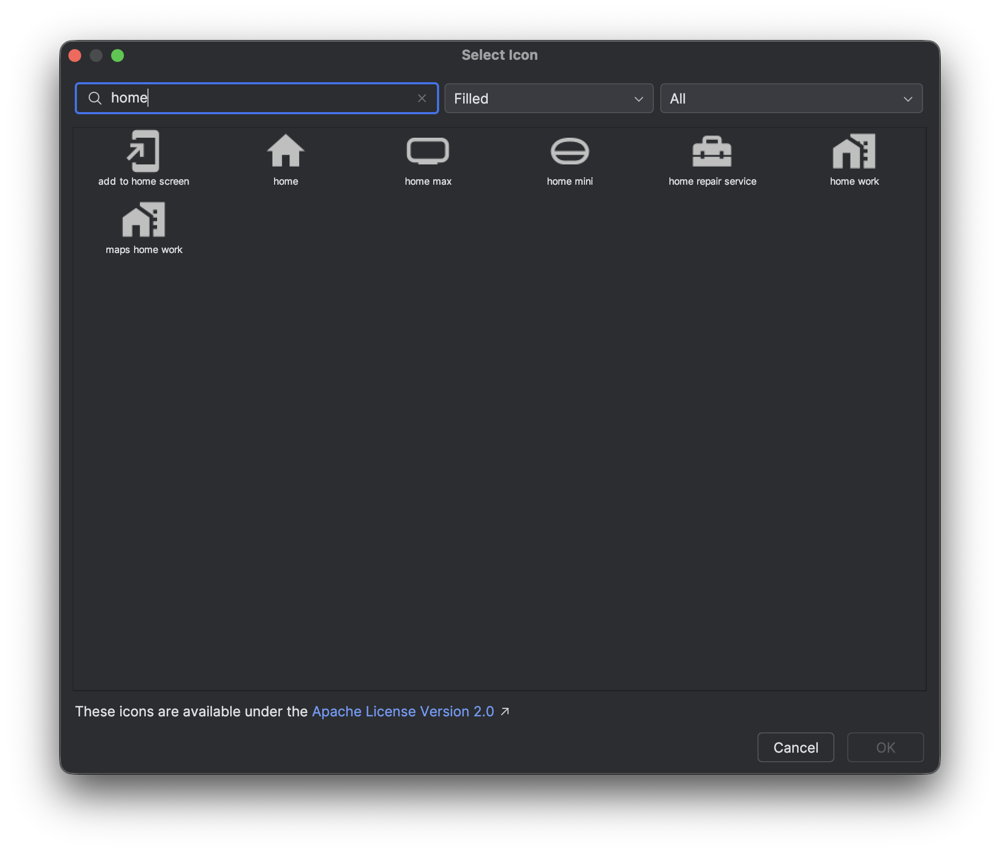
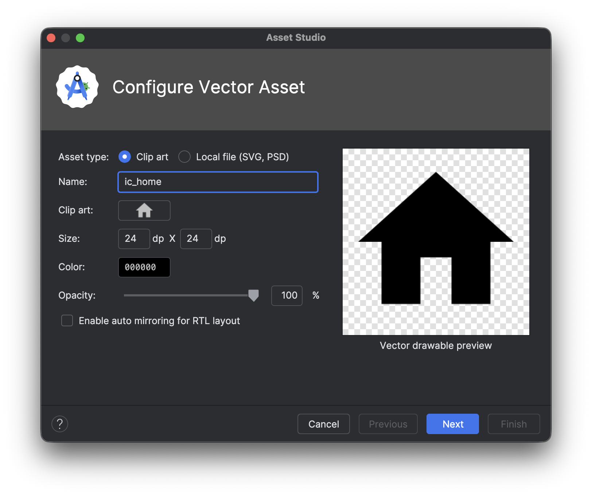

# LAB 10 – Navigation Drawer et Fragments : Navigation modulaire 📱

## Aperçu de l'application

Une application Android intégrant un menu latéral de navigation (Navigation Drawer) permettant de basculer dynamiquement entre plusieurs fragments. L'application contient deux fragments d'affichage avec des couleurs personnalisées et un fragment liste affichant une liste d'éléments.

| Écran principal (Fragment 1) | Menu latéral ouvert |
|------------------------------|---------------------|
|  |  |

| Fragment 2 (fond bleu) | Fragment Liste |
|------------------------|----------------|
|  |  |

## Fonctionnalités

- **Menu latéral** : Navigation Drawer accessible par glissement ou clic sur l'icône hamburger
- **Premier Fragment** : Affichage avec fond rose et texte "Premier Fragment"
- **Deuxième Fragment** : Affichage avec fond bleu et texte "Deuxième Fragment"
- **Fragment Liste** : Affichage d'une liste dynamique de 10 éléments
- **Navigation fluide** : Changement dynamique du contenu sans recharger l'activité

## Architecture du projet

```
lab10_dev/
├── app/src/main/
│   ├── java/com.example.lab10_dev/
│   │   ├── MainActivity.java
│   │   ├── FirstFragment.java
│   │   ├── SecondFragment.java
│   │   └── ItemListFragment.java
│   └── res/
│       ├── layout/
│       │   ├── activity_main.xml
│       │   ├── content_main.xml
│       │   ├── fragment_first.xml
│       │   ├── fragment_second.xml
│       │   └── fragment_list.xml
│       ├── menu/
│       │   └── activity_main_drawer.xml
│       ├── drawable/
│       │   ├── ic_home.xml
│       │   ├── ic_dashboard.xml
│       │   └── ic_list.xml
│       └── navigation/
│           └── mobile_navigation.xml
```

## Création du projet

### Étape 1 : Création du projet avec Navigation Drawer

1. Ouvrir **Android Studio**
2. Cliquer sur **New Project** > **Navigation Drawer Views Activity**
3. Configurer le projet :
   - **Nom** : `lab10_dev`
   - **Package name** : `com.example.lab10_dev`
   - **Langage** : Java
   - **Minimum SDK** : API 24 (Android 7.0)

| Création du projet Navigation Drawer |
|--------------------------------------|
|  |

### Étape 2 : Ajout des icônes vectorielles

**Création des icônes via Vector Asset Studio :**

1. Clic droit sur `res/drawable` → **New** → **Vector Asset**
2. Cliquer sur **Clip Art** pour choisir une icône

| Page initiale Vector Asset |
|---------------------------|
|  |

3. Rechercher l'icône souhaitée (exemple : "home")

| Sélection de l'icône "home" |
|---------------------------|
|  |

4. Nommer le fichier et confirmer

| Enregistrement de l'icône |
|--------------------------|
|  |

**Répéter l'opération pour :**
- `ic_home.xml` (icône maison)
- `ic_dashboard.xml` (icône tableau de bord)
- `ic_list.xml` (icône liste)

### Étape 3 : Configuration du menu latéral

**Fichier :** `res/menu/activity_main_drawer.xml`

```xml
<?xml version="1.0" encoding="utf-8"?>
<menu xmlns:android="http://schemas.android.com/apk/res/android">
    <item
        android:id="@+id/nav_first_screen"
        android:icon="@drawable/ic_home"
        android:title="Premier Ecran" />
    <item
        android:id="@+id/nav_second_screen"
        android:icon="@drawable/ic_dashboard"
        android:title="Deuxieme Ecran" />
    <item
        android:id="@+id/nav_list_screen"
        android:icon="@drawable/ic_list"
        android:title="Liste d'éléments" />
</menu>
```

## Code source complet

### 1. Layout principal – `res/layout/activity_main.xml`

```xml
<?xml version="1.0" encoding="utf-8"?>
<androidx.drawerlayout.widget.DrawerLayout xmlns:android="http://schemas.android.com/apk/res/android"
    xmlns:app="http://schemas.android.com/apk/res-auto"
    xmlns:tools="http://schemas.android.com/tools"
    android:id="@+id/drawer_layout"
    android:layout_width="match_parent"
    android:layout_height="match_parent"
    android:fitsSystemWindows="true"
    tools:openDrawer="start">

    <include
        layout="@layout/app_bar_main"
        android:layout_width="match_parent"
        android:layout_height="match_parent" />

    <com.google.android.material.navigation.NavigationView
        android:id="@+id/nav_view"
        android:layout_width="wrap_content"
        android:layout_height="match_parent"
        android:layout_gravity="start"
        android:fitsSystemWindows="true"
        app:headerLayout="@layout/nav_header_main"
        app:menu="@menu/activity_main_drawer" />
</androidx.drawerlayout.widget.DrawerLayout>
```

### 2. Conteneur de fragments – `res/layout/content_main.xml`

```xml
<?xml version="1.0" encoding="utf-8"?>
<LinearLayout xmlns:android="http://schemas.android.com/apk/res/android"
    xmlns:app="http://schemas.android.com/apk/res-auto"
    xmlns:tools="http://schemas.android.com/tools"
    android:layout_width="match_parent"
    android:layout_height="match_parent"
    android:orientation="vertical"
    app:layout_behavior="@string/appbar_scrolling_view_behavior"
    tools:showIn="@layout/activity_main">

    <FrameLayout
        android:id="@+id/fragment_container"
        android:layout_width="match_parent"
        android:layout_height="match_parent" />
</LinearLayout>
```

### 3. Premier Fragment – `res/layout/fragment_first.xml`

```xml
<?xml version="1.0" encoding="utf-8"?>
<LinearLayout xmlns:android="http://schemas.android.com/apk/res/android"
    android:layout_width="match_parent"
    android:layout_height="match_parent"
    android:gravity="center"
    android:orientation="vertical"
    android:background="#F8BBD0">

    <TextView
        android:text="Premier Fragment"
        android:textSize="24sp"
        android:textStyle="bold"
        android:textColor="#000000"
        android:layout_width="wrap_content"
        android:layout_height="wrap_content" />

    <TextView
        android:text="Contenu du premier fragment"
        android:textSize="16sp"
        android:textColor="#333333"
        android:layout_width="wrap_content"
        android:layout_height="wrap_content"
        android:layout_marginTop="16dp" />
</LinearLayout>
```

### 4. Deuxième Fragment – `res/layout/fragment_second.xml`

```xml
<?xml version="1.0" encoding="utf-8"?>
<LinearLayout xmlns:android="http://schemas.android.com/apk/res/android"
    android:layout_width="match_parent"
    android:layout_height="match_parent"
    android:gravity="center"
    android:orientation="vertical"
    android:background="#3F51B5">

    <TextView
        android:text="Deuxieme Fragment"
        android:textSize="24sp"
        android:textStyle="bold"
        android:textColor="#FFFFFF"
        android:layout_width="wrap_content"
        android:layout_height="wrap_content" />

    <TextView
        android:text="Contenu du deuxième fragment"
        android:textSize="16sp"
        android:textColor="#DDDDDD"
        android:layout_width="wrap_content"
        android:layout_height="wrap_content"
        android:layout_marginTop="16dp" />
</LinearLayout>
```

### 5. Fragment Liste – `res/layout/fragment_list.xml`

```xml
<?xml version="1.0" encoding="utf-8"?>
<FrameLayout xmlns:android="http://schemas.android.com/apk/res/android"
    android:layout_width="match_parent"
    android:layout_height="match_parent"
    android:background="#FFFFFF">

    <ListView
        android:id="@android:id/list"
        android:layout_width="match_parent"
        android:layout_height="match_parent" />
</FrameLayout>
```

### 6. Activité principale – `MainActivity.java`

```java
package com.example.lab10_dev;

import android.os.Bundle;
import android.view.MenuItem;
import androidx.annotation.NonNull;
import androidx.appcompat.app.ActionBarDrawerToggle;
import androidx.appcompat.app.AppCompatActivity;
import androidx.appcompat.widget.Toolbar;
import androidx.core.view.GravityCompat;
import androidx.drawerlayout.widget.DrawerLayout;
import androidx.fragment.app.Fragment;
import com.google.android.material.navigation.NavigationView;

public class MainActivity extends AppCompatActivity implements NavigationView.OnNavigationItemSelectedListener {

    private DrawerLayout mainDrawerLayout;

    @Override
    protected void onCreate(Bundle savedInstanceState) {
        super.onCreate(savedInstanceState);
        setContentView(R.layout.activity_main);

        Toolbar appToolbar = findViewById(R.id.toolbar);
        setSupportActionBar(appToolbar);

        mainDrawerLayout = findViewById(R.id.drawer_layout);
        NavigationView sideNavView = findViewById(R.id.nav_view);
        sideNavView.setNavigationItemSelectedListener(this);

        ActionBarDrawerToggle drawerToggle = new ActionBarDrawerToggle(
                this, mainDrawerLayout, appToolbar,
                R.string.navigation_drawer_open,
                R.string.navigation_drawer_close);
        mainDrawerLayout.addDrawerListener(drawerToggle);
        drawerToggle.syncState();

        if (savedInstanceState == null) {
            getSupportFragmentManager().beginTransaction()
                    .replace(R.id.fragment_container, new FirstFragment())
                    .commit();
            sideNavView.setCheckedItem(R.id.nav_first_screen);
        }
    }

    @Override
    public boolean onNavigationItemSelected(@NonNull MenuItem menuItem) {
        int selectedId = menuItem.getItemId();
        Fragment activeFragment = null;

        if (selectedId == R.id.nav_first_screen) {
            activeFragment = new FirstFragment();
        } else if (selectedId == R.id.nav_second_screen) {
            activeFragment = new SecondFragment();
        } else if (selectedId == R.id.nav_list_screen) {
            activeFragment = new ItemListFragment();
        }

        if (activeFragment != null) {
            getSupportFragmentManager().beginTransaction()
                    .replace(R.id.fragment_container, activeFragment)
                    .commit();
        }

        if (mainDrawerLayout != null) {
            mainDrawerLayout.closeDrawer(GravityCompat.START);
        }
        return true;
    }

    @Override
    public void onBackPressed() {
        if (mainDrawerLayout != null && mainDrawerLayout.isDrawerOpen(GravityCompat.START)) {
            mainDrawerLayout.closeDrawer(GravityCompat.START);
        } else {
            super.onBackPressed();
        }
    }
}
```

### 7. Premier Fragment Java – `FirstFragment.java`

```java
package com.example.lab10_dev;

import android.os.Bundle;
import android.view.LayoutInflater;
import android.view.View;
import android.view.ViewGroup;
import androidx.fragment.app.Fragment;

public class FirstFragment extends Fragment {

    @Override
    public View onCreateView(LayoutInflater inflater, ViewGroup container,
                             Bundle savedInstanceState) {
        return inflater.inflate(R.layout.fragment_first, container, false);
    }
}
```

### 8. Deuxième Fragment Java – `SecondFragment.java`

```java
package com.example.lab10_dev;

import android.os.Bundle;
import android.view.LayoutInflater;
import android.view.View;
import android.view.ViewGroup;
import androidx.fragment.app.Fragment;

public class SecondFragment extends Fragment {

    @Override
    public View onCreateView(LayoutInflater inflater, ViewGroup container,
                             Bundle savedInstanceState) {
        return inflater.inflate(R.layout.fragment_second, container, false);
    }
}
```

### 9. Fragment Liste Java – `ItemListFragment.java`

```java
package com.example.lab10_dev;

import android.os.Bundle;
import android.widget.ArrayAdapter;
import androidx.fragment.app.ListFragment;

public class ItemListFragment extends ListFragment {

    @Override
    public void onActivityCreated(Bundle savedInstanceState) {
        super.onActivityCreated(savedInstanceState);

        String[] dataItems = {
            "Premier élément", "Deuxième élément", "Troisième élément",
            "Quatrième élément", "Cinquième élément", "Sixième élément",
            "Septième élément", "Huitième élément", "Neuvième élément",
            "Dixième élément"
        };

        ArrayAdapter<String> itemAdapter = new ArrayAdapter<>(
                requireActivity(),
                android.R.layout.simple_list_item_1,
                dataItems
        );

        setListAdapter(itemAdapter);
    }
}
```

## Configuration Gradle

**build.gradle (Module: app) :**

```gradle
dependencies {
    implementation 'androidx.navigation:navigation-fragment:2.5.3'
    implementation 'androidx.navigation:navigation-ui:2.5.3'
    implementation 'com.google.android.material:material:1.9.0'
}
```

## Comment exécuter l'application

1. **Créer un projet** Android Studio avec "Navigation Drawer Views Activity"
2. **Nom du projet** : `lab10_dev`
3. **Langage** : Java
4. **API minimum** : 24 (Android 7.0)
5. **Ajouter les icônes vectorielles** via Vector Asset Studio (pic2, pic3, pic4)
6. **Remplacer** les fichiers par les codes ci-dessus
7. **Créer** les fragments Java (`FirstFragment.java`, `SecondFragment.java`, `ItemListFragment.java`)
8. **Compiler** et exécuter sur émulateur ou appareil physique

## Fonctionnement

| Action | Résultat |
|--------|----------|
| Clic sur l'icône ☰ (hamburger) | Ouverture du menu latéral (pic6) |
| Sélection "Premier Ecran" | Affiche le Fragment 1 fond rose (pic5) |
| Sélection "Deuxieme Ecran" | Affiche le Fragment 2 fond bleu (pic7) |
| Sélection "Liste d'éléments" | Affiche une liste de 10 éléments (pic8) |
| Glisser depuis le bord gauche | Ouvre/ferme le menu latéral |

## Rendu visuel attendu

| Fragment 1 (rose) | Fragment 2 (bleu) | Fragment Liste |
|-------------------|-------------------|----------------|
|  |  |  |

| Menu latéral |
|--------------|
|  |

## Points techniques abordés

- **Navigation Drawer** : menu latéral accessible par glissement ou clic
- **FragmentManager** : gestion dynamique des fragments avec `beginTransaction()`
- **FragmentTransaction** : opération `replace()` pour changer l'affichage
- **ListFragment** : fragment spécialisé pour afficher une liste
- **ArrayAdapter** : liaison entre données (String[]) et vue (ListView)
- **ActionBarDrawerToggle** : synchronisation entre Toolbar et DrawerLayout
- **Vector Asset Studio** : création d'icônes vectorielles personnalisées

---

**Auteur** : ELHEZZAM RANIA  
**Réalisé avec** : Android Studio sur MacOS Apple Silicon M2 (ARM-64 Native)
